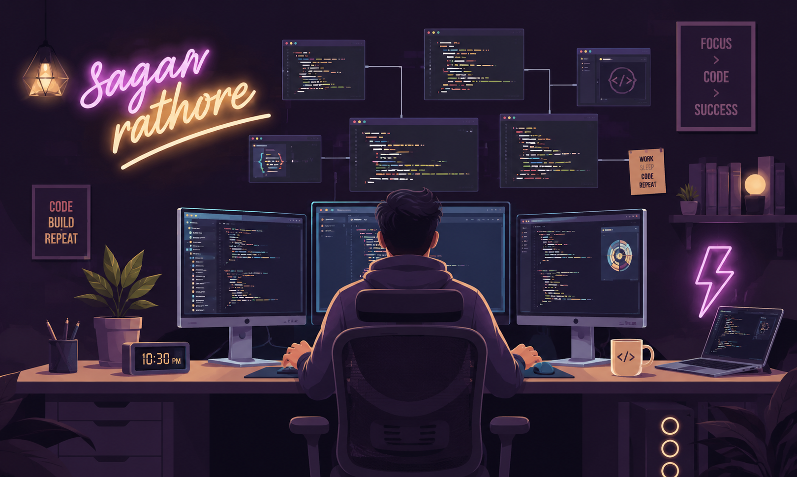

<h1 align="center">
    
</h1>

<h4 align="center">🚀 Welcome to my GitHub universe! 🚀</h4>
<h2 align="center">👋 I'm sagar, a passionate Full stack developer and coding enthusiast from India🌍!</h2>

 

<h2 align="center">👨‍💻 About Me 👨‍💻</h2>

 
🌟 Passionate full stack Developer 🚀

 
🎨 Creative Tech Enthusiast 💡

 
🔧 Problem-Solving Extraordinaire 💪

 
🌟 Innovation Architect 🛠️

 
🎮 Coding Maverick 🕹️

<h5>h
  🔗 Know more About me on <a href="https://www.linkedin.com/in/sagar-rathore-3906542ab/" target="_blank">LinkedIn</a>
</h5>

 
<h2 align="center">📚 My Stack 📚</h2>

    

<h2 align="center">🎨 Frontend 🎨</h2>

    
    

<h2 align="center">⚙️ Backend ⚙️</h2>

    

<h2 align="center">⚒️ Tools & Technologies ⚒️</h2>

    

 

 

  <h2>🐍 My Contributions 🐍</h2>
   
  
  
     

<h2 align="center">⚡ Stats ⚡</h2>
 

  
  
   
  

  

<h1 align="center">
    
</h1>
